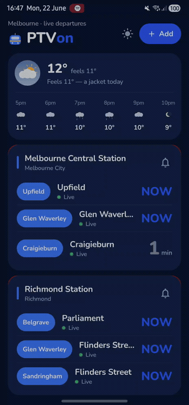
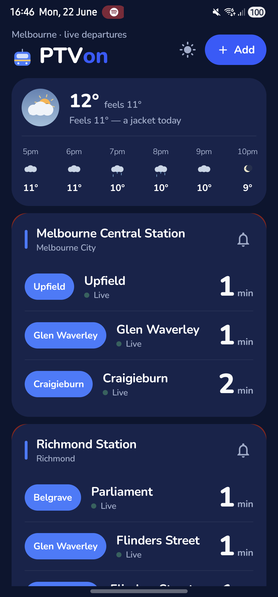
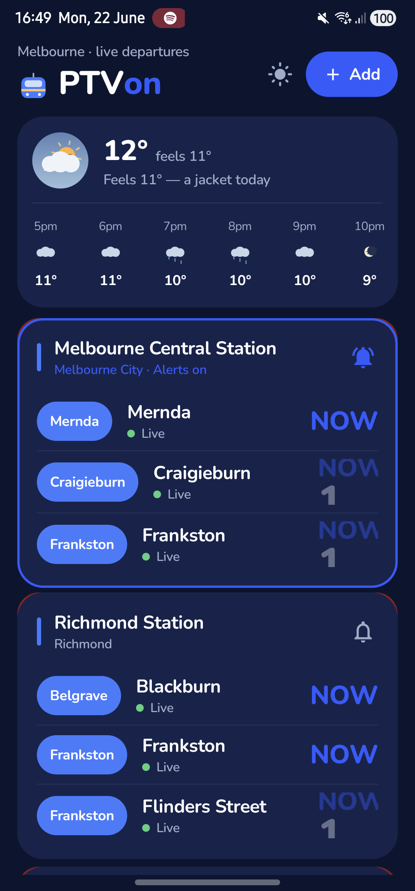

# PTVon

A hyper-glanceable, modern Android app for live public-transport departures across Victoria, Australia (trains, trams, buses). Pin the stops you use, see live countdowns at a glance, track one stop for departure alerts, and get real-feel weather advice on what to wear — all in a warm, friendly UI.

> Built with Jetpack Compose. Powered by the [PTV Timetable API v3](https://timetableapi.ptv.vic.gov.au/swagger/ui/index) and [Open-Meteo](https://open-meteo.com/).

## Screenshots

<p align="left">
  
  &nbsp;&nbsp;
  
  &nbsp;&nbsp;
  
</p>

<sub>Live departures for Melbourne Central, Richmond and Flinders Street, with an animated weather badge + 6-hour forecast. The tracked stop (blue outline) receives 10/5/1-minute alerts.</sub>

## Download

Grab the latest APK from the [**Releases**](../../releases) page and sideload it (enable "install from unknown sources"). The prebuilt APK is **live out of the box** — it ships with the maintainer's PTV credentials, so you get real departures with zero setup.

> Building from source instead? The repo intentionally omits those credentials, so a source build runs in **demo mode** (sample departures; weather is always live) until you add your own free PTV key — see [Getting started](#getting-started). For a public deployment, route requests through the [Cloudflare Worker proxy](proxy/) so no key is embedded in the app.

## Features

- **Pin up to 4 stops** — search and save the stops you use most; they load instantly on every launch.
- **Live countdowns** — real-time "minutes to arrival" from the PTV API (`estimated` with `scheduled` fallback).
- **Track one stop** — tap the bell (or double-tap a card) to make it the single "current stop"; get **10 / 5 / 1-minute** exact alarms plus an ongoing lock-screen live countdown.
- **Service disruptions** — delays and alerts shown inline per stop.
- **Weather** — live real-feel advice ("a jacket today") with an animated weather badge and a 6-hour forecast strip.
- **Day / night theme** and a friendly, rounded design.

## Tech stack

- **Language:** Kotlin
- **UI:** Jetpack Compose + Material 3
- **Architecture:** MVVM + Clean Architecture, UDF, Kotlin Coroutines / Flow
- **DI:** Hilt
- **Networking:** Retrofit + OkHttp + Kotlinx Serialization
- **Storage:** DataStore (Preferences)
- **Background:** WorkManager / AlarmManager (exact alerts) + a foreground service (live lock-screen banner)

## Getting started

1. Clone the repo and open it in Android Studio (or build from the CLI).
2. Get free PTV Timetable API credentials — request a **devid** (User ID) and **API key** from PTV: <https://www.ptv.vic.gov.au/footer/data-and-reporting/datasets/ptv-timetable-api/>
3. Create `local.properties` in the project root (it is gitignored) with your SDK path and credentials:

   ```properties
   sdk.dir=/path/to/Android/sdk
   ptv.devId=YOUR_DEVID
   ptv.apiKey=YOUR_API_KEY
   ```

   Leave the two `ptv.*` values blank to run in **demo mode** with sample departures (weather is always live and keyless).
4. Build & install:

   ```bash
   ./gradlew :app:installDebug
   ```

### Optional: backend proxy (recommended for public releases)

To keep your key out of the APK entirely, deploy the [Cloudflare Worker proxy](proxy/) and set
`ptv.proxyUrl` in `local.properties`. The app then routes all PTV calls through the Worker (which
holds the key as a secret) and ships **no** credentials — see [`proxy/README.md`](proxy/README.md).

## PTV API authentication

The PTV API requires every request to carry a `devid` and an HMAC-SHA1 `signature`. The signature is computed over the request **path + query** (not the host), with `devid` appended *before* signing. This is handled automatically by an OkHttp interceptor (`PtvAuthInterceptor`).

## Attribution

- Timetable data © Public Transport Victoria, used under [CC BY 4.0](https://creativecommons.org/licenses/by/4.0/).
- Weather data by [Open-Meteo](https://open-meteo.com/), under [CC BY 4.0](https://creativecommons.org/licenses/by/4.0/).

PTVon is an independent app and is not affiliated with or endorsed by Public Transport Victoria.

## License

MIT — see [LICENSE](LICENSE).
